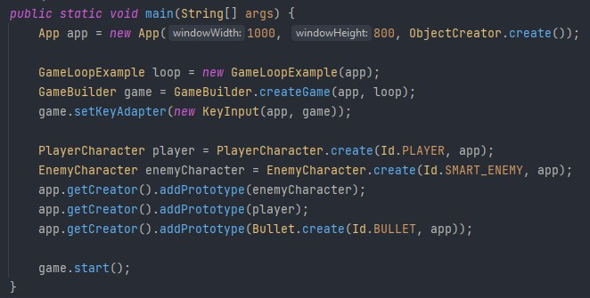

````
  _______ _           _____                      ______             _            
 |__   __| |         / ____|                    |  ____|           (_)           
    | |  | |__   ___| |  __  __ _ _ __ ___   ___| |__   _ __   __ _ _ _ __   ___ 
    | |  | '_ \ / _ \ | |_ |/ _` | '_ ` _ \ / _ \  __| | '_ \ / _` | | '_ \ / _ \
    | |  | | | |  __/ |__| | (_| | | | | | |  __/ |____| | | | (_| | | | | |  __/
    |_|  |_| |_|\___|\_____|\__,_|_| |_| |_|\___|______|_| |_|\__, |_|_| |_|\___|
                                                               __/ |             
                                                              |___/              
````

# Getting started
>To use this project you need Java 16 or newer.
>We have tested it with both Java 16 and 17.

## Authors
- Simen Jacobsen Øygard [@simenyo](https://www.github.com/simenyo)
- Erik Teien Jarem [@eriktja](https://www.github.com/eriktja)

## Demo
> This project contains a demo of a working game which is intended as an example of how this game engine can be used. 
> - This is a simple "top down"-shooter, where you kill zombies.
> - If  you want to learn how to use this framework, this is a nice place to start.

## Installation
1. Clone the repository.
2. Open the project in your favorite IDE
>This Framework use Java.awt and Java.Swing. Both libraries are native to Java Development Kit. 
> <br>__If you want to try the demo:__
3. View the image at the end of the readme.md
4. Build the project and run Main.java.
5. Get to know the framework by making changes and new implementations.


## Making a game

> Clone the repository.

### Step 1
>Create your own class which extends GameObject. This is where you create the characters and items to appear in game.
>   - __tick()__ is what the GameObject does. If you want it to move, this is where you implement it.
>   - __render()__ is called each iteration of the game. This is where you draw the GameObject. See demo for examples.
>   - __hitbox()__ uses the size of the GameObject to return a java.awt.Rectangle. This is used in the collision()-method.
>   - __collision()__ use this to control what happens when two GameObjects intersect. Use it in tick()-method.
>   - __static create()__ calls the constructor. Can either be used to create a prototype to add it in Creator.prototypes or used directly in GameLoop.tick().
>       - __clone()__ is used in ObjectCreator which implements the Creator-interface. This uses the clone()-method to make new instances of objects in the Create.prototypes.
>       - __Id__: When instantiating a new GameObject you need to give it an Id from the Id-enum. This is how GameObjects differentiate from other GameObjects, and how the framework decides which GameObject should be affected by KeyEvents. 
### Step 2
> Create a new class which implements GameLoop. <br>This class is where you will specify when GameObjects are added to the game.
> - __tick()__ is where you add __GameObjects__ to __ApplicationHandler.objects__. We recommend using variables to track progress of the game.
> - __reset()__ is called when the game has ended. Use this to reset variables used in __tick()__.
### Step 3
> - Create a class which extends __KeyInput__ or make changes to the KeyInput-class to fit with your game-idea.
> - Use Id's from the __Id__-enum to decide which GameObjects respond to KeyEvents. 
> - __KeyInput__ extends __KeyAdapter__. You can make your own KeyEvent-handler by extending directly from __KeyAdapter__.
### Step 4
> - Create a class which extends HeadUpDisplay or make changes to the HeadUpDisplay-class to fit with your game-idea.
> - __tick()__ update variables used in HeadUpDisplay.
> - __render()__ draw the HeadUpDisplay.
> - __loseGame()__. Conditions for losing a game. Will return you to the Menu with a lose-message.
> - __winGame()__. Conditions for winning a game. Will return you to the Menu with a win-message.
> - __reset()__ will reset variables used in the game. 
### Step 5
> Add the following in __main.java__:
> 1. An instance of __ApplicationHandler__. You may use __App__ if it fits your needs. 
>    1. You may choose to add a __Creator__ here. Can be added by typing __ObjectCreator.get()__ as a parameter in the App constructor.
> 2. An instance of your __GameLoop__.
> 3. A new instance of the __GameBuilder__-class. 
>    1. Needs an __ApplicationHandler__ and a __GameLoop__.
>    2. Will create a __Window__ and __Menu__.
>    3. Will create a __HeadUpDisplay__ if none is given in create-method. 
>    4. Specify __KeyAdapter__ by using the __setKeyAdapter()__-method in __GameBuilder__.
> 4. Two methods for __Adding GameObjects__
>    1. __Method 1__
>       1. Create _prototypes_ by making an instance of __ObjectCreator__ and adding the GameObjects you make to the prototypes list.
>       2. In __GameLoop.tick()__ use __ObjectCreator.cloneGameObject()__ and add the returned GameObject to __ApplicationHandler.objects__.
>    2. __Method 2__
>       1. Create the __GameObjects__ directly in __GameLoop.tick()__, and add them to __ApplicationHandler.objects__.

### Try this to get started. Good luck!
>
